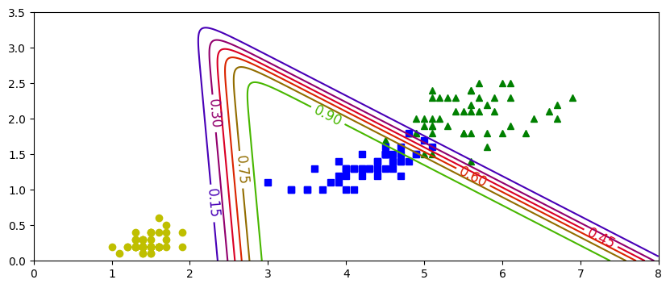

```python
from sklearn import datasets
iris = datasets.load_iris()
list(iris.keys())
```


    ['data',
     'target',
     'frame',
     'target_names',
     'DESCR',
     'feature_names',
     'filename',
     'data_module']


```python
iris
```


    {'data': array([[5.1, 3.5, 1.4, 0.2],
            [4.9, 3. , 1.4, 0.2],
            [4.7, 3.2, 1.3, 0.2],
            [4.6, 3.1, 1.5, 0.2],
            [5. , 3.6, 1.4, 0.2],
            [5.4, 3.9, 1.7, 0.4],
            [4.6, 3.4, 1.4, 0.3],
            [5. , 3.4, 1.5, 0.2],
            [4.4, 2.9, 1.4, 0.2],
            [4.9, 3.1, 1.5, 0.1],
            [5.4, 3.7, 1.5, 0.2],
            [4.8, 3.4, 1.6, 0.2],
            [4.8, 3. , 1.4, 0.1],
            [4.3, 3. , 1.1, 0.1],
            [5.8, 4. , 1.2, 0.2],
            [5.7, 4.4, 1.5, 0.4],
            [5.4, 3.9, 1.3, 0.4],
            [5.1, 3.5, 1.4, 0.3],
            [5.7, 3.8, 1.7, 0.3],
            [5.1, 3.8, 1.5, 0.3],
            [5.4, 3.4, 1.7, 0.2],
            [5.1, 3.7, 1.5, 0.4],
            [4.6, 3.6, 1. , 0.2],
            [5.1, 3.3, 1.7, 0.5],
            [4.8, 3.4, 1.9, 0.2],
            [5. , 3. , 1.6, 0.2],
            [5. , 3.4, 1.6, 0.4],
            [5.2, 3.5, 1.5, 0.2],
            [5.2, 3.4, 1.4, 0.2],
            [4.7, 3.2, 1.6, 0.2],
            [4.8, 3.1, 1.6, 0.2],
            [5.4, 3.4, 1.5, 0.4],
            [5.2, 4.1, 1.5, 0.1],
            [5.5, 4.2, 1.4, 0.2],
            [4.9, 3.1, 1.5, 0.2],
            [5. , 3.2, 1.2, 0.2],
            [5.5, 3.5, 1.3, 0.2],
            [4.9, 3.6, 1.4, 0.1],
            [4.4, 3. , 1.3, 0.2],
            [5.1, 3.4, 1.5, 0.2],
            [5. , 3.5, 1.3, 0.3],
            [4.5, 2.3, 1.3, 0.3],
            [4.4, 3.2, 1.3, 0.2],
            [5. , 3.5, 1.6, 0.6],
            [5.1, 3.8, 1.9, 0.4],
            [4.8, 3. , 1.4, 0.3],
            [5.1, 3.8, 1.6, 0.2],
            [4.6, 3.2, 1.4, 0.2],
            [5.3, 3.7, 1.5, 0.2],
            [5. , 3.3, 1.4, 0.2],
            [7. , 3.2, 4.7, 1.4],
            [6.4, 3.2, 4.5, 1.5],
            [6.9, 3.1, 4.9, 1.5],
            [5.5, 2.3, 4. , 1.3],
            [6.5, 2.8, 4.6, 1.5],
            [5.7, 2.8, 4.5, 1.3],
            [6.3, 3.3, 4.7, 1.6],
            [4.9, 2.4, 3.3, 1. ],
            [6.6, 2.9, 4.6, 1.3],
            [5.2, 2.7, 3.9, 1.4],
            [5. , 2. , 3.5, 1. ],
            [5.9, 3. , 4.2, 1.5],
            [6. , 2.2, 4. , 1. ],
            [6.1, 2.9, 4.7, 1.4],
            [5.6, 2.9, 3.6, 1.3],
            [6.7, 3.1, 4.4, 1.4],
            [5.6, 3. , 4.5, 1.5],
            [5.8, 2.7, 4.1, 1. ],
            [6.2, 2.2, 4.5, 1.5],
            [5.6, 2.5, 3.9, 1.1],
            [5.9, 3.2, 4.8, 1.8],
            [6.1, 2.8, 4. , 1.3],
            [6.3, 2.5, 4.9, 1.5],
            [6.1, 2.8, 4.7, 1.2],
            [6.4, 2.9, 4.3, 1.3],
            [6.6, 3. , 4.4, 1.4],
            [6.8, 2.8, 4.8, 1.4],
            [6.7, 3. , 5. , 1.7],
            [6. , 2.9, 4.5, 1.5],
            [5.7, 2.6, 3.5, 1. ],
            [5.5, 2.4, 3.8, 1.1],
            [5.5, 2.4, 3.7, 1. ],
            [5.8, 2.7, 3.9, 1.2],
            [6. , 2.7, 5.1, 1.6],
            [5.4, 3. , 4.5, 1.5],
            [6. , 3.4, 4.5, 1.6],
            [6.7, 3.1, 4.7, 1.5],
            [6.3, 2.3, 4.4, 1.3],
            [5.6, 3. , 4.1, 1.3],
            [5.5, 2.5, 4. , 1.3],
            [5.5, 2.6, 4.4, 1.2],
            [6.1, 3. , 4.6, 1.4],
            [5.8, 2.6, 4. , 1.2],
            [5. , 2.3, 3.3, 1. ],
            [5.6, 2.7, 4.2, 1.3],
            [5.7, 3. , 4.2, 1.2],
            [5.7, 2.9, 4.2, 1.3],
            [6.2, 2.9, 4.3, 1.3],
            [5.1, 2.5, 3. , 1.1],
            [5.7, 2.8, 4.1, 1.3],
            [6.3, 3.3, 6. , 2.5],
            [5.8, 2.7, 5.1, 1.9],
            [7.1, 3. , 5.9, 2.1],
            [6.3, 2.9, 5.6, 1.8],
            [6.5, 3. , 5.8, 2.2],
            [7.6, 3. , 6.6, 2.1],
            [4.9, 2.5, 4.5, 1.7],
            [7.3, 2.9, 6.3, 1.8],
            [6.7, 2.5, 5.8, 1.8],
            [7.2, 3.6, 6.1, 2.5],
            [6.5, 3.2, 5.1, 2. ],
            [6.4, 2.7, 5.3, 1.9],
            [6.8, 3. , 5.5, 2.1],
            [5.7, 2.5, 5. , 2. ],
            [5.8, 2.8, 5.1, 2.4],
            [6.4, 3.2, 5.3, 2.3],
            [6.5, 3. , 5.5, 1.8],
            [7.7, 3.8, 6.7, 2.2],
            [7.7, 2.6, 6.9, 2.3],
            [6. , 2.2, 5. , 1.5],
            [6.9, 3.2, 5.7, 2.3],
            [5.6, 2.8, 4.9, 2. ],
            [7.7, 2.8, 6.7, 2. ],
            [6.3, 2.7, 4.9, 1.8],
            [6.7, 3.3, 5.7, 2.1],
            [7.2, 3.2, 6. , 1.8],
            [6.2, 2.8, 4.8, 1.8],
            [6.1, 3. , 4.9, 1.8],
            [6.4, 2.8, 5.6, 2.1],
            [7.2, 3. , 5.8, 1.6],
            [7.4, 2.8, 6.1, 1.9],
            [7.9, 3.8, 6.4, 2. ],
            [6.4, 2.8, 5.6, 2.2],
            [6.3, 2.8, 5.1, 1.5],
            [6.1, 2.6, 5.6, 1.4],
            [7.7, 3. , 6.1, 2.3],
            [6.3, 3.4, 5.6, 2.4],
            [6.4, 3.1, 5.5, 1.8],
            [6. , 3. , 4.8, 1.8],
            [6.9, 3.1, 5.4, 2.1],
            [6.7, 3.1, 5.6, 2.4],
            [6.9, 3.1, 5.1, 2.3],
            [5.8, 2.7, 5.1, 1.9],
            [6.8, 3.2, 5.9, 2.3],
            [6.7, 3.3, 5.7, 2.5],
            [6.7, 3. , 5.2, 2.3],
            [6.3, 2.5, 5. , 1.9],
            [6.5, 3. , 5.2, 2. ],
            [6.2, 3.4, 5.4, 2.3],
            [5.9, 3. , 5.1, 1.8]]),
     'target': array([0, 0, 0, 0, 0, 0, 0, 0, 0, 0, 0, 0, 0, 0, 0, 0, 0, 0, 0, 0, 0, 0,
            0, 0, 0, 0, 0, 0, 0, 0, 0, 0, 0, 0, 0, 0, 0, 0, 0, 0, 0, 0, 0, 0,
            0, 0, 0, 0, 0, 0, 1, 1, 1, 1, 1, 1, 1, 1, 1, 1, 1, 1, 1, 1, 1, 1,
            1, 1, 1, 1, 1, 1, 1, 1, 1, 1, 1, 1, 1, 1, 1, 1, 1, 1, 1, 1, 1, 1,
            1, 1, 1, 1, 1, 1, 1, 1, 1, 1, 1, 1, 2, 2, 2, 2, 2, 2, 2, 2, 2, 2,
            2, 2, 2, 2, 2, 2, 2, 2, 2, 2, 2, 2, 2, 2, 2, 2, 2, 2, 2, 2, 2, 2,
            2, 2, 2, 2, 2, 2, 2, 2, 2, 2, 2, 2, 2, 2, 2, 2, 2, 2]),
     'frame': None,
     'target_names': array(['setosa', 'versicolor', 'virginica'], dtype='<U10'),
     'DESCR': '.. _iris_dataset:\n\nIris plants dataset\n--------------------\n\n**Data Set Characteristics:**\n\n    :Number of Instances: 150 (50 in each of three classes)\n    :Number of Attributes: 4 numeric, predictive attributes and the class\n    :Attribute Information:\n        - sepal length in cm\n        - sepal width in cm\n        - petal length in cm\n        - petal width in cm\n        - class:\n                - Iris-Setosa\n                - Iris-Versicolour\n                - Iris-Virginica\n                \n    :Summary Statistics:\n\n    ============== ==== ==== ======= ===== ====================\n                    Min  Max   Mean    SD   Class Correlation\n    ============== ==== ==== ======= ===== ====================\n    sepal length:   4.3  7.9   5.84   0.83    0.7826\n    sepal width:    2.0  4.4   3.05   0.43   -0.4194\n    petal length:   1.0  6.9   3.76   1.76    0.9490  (high!)\n    petal width:    0.1  2.5   1.20   0.76    0.9565  (high!)\n    ============== ==== ==== ======= ===== ====================\n\n    :Missing Attribute Values: None\n    :Class Distribution: 33.3% for each of 3 classes.\n    :Creator: R.A. Fisher\n    :Donor: Michael Marshall (MARSHALL%PLU@io.arc.nasa.gov)\n    :Date: July, 1988\n\nThe famous Iris database, first used by Sir R.A. Fisher. The dataset is taken\nfrom Fisher\'s paper. Note that it\'s the same as in R, but not as in the UCI\nMachine Learning Repository, which has two wrong data points.\n\nThis is perhaps the best known database to be found in the\npattern recognition literature.  Fisher\'s paper is a classic in the field and\nis referenced frequently to this day.  (See Duda & Hart, for example.)  The\ndata set contains 3 classes of 50 instances each, where each class refers to a\ntype of iris plant.  One class is linearly separable from the other 2; the\nlatter are NOT linearly separable from each other.\n\n.. topic:: References\n\n   - Fisher, R.A. "The use of multiple measurements in taxonomic problems"\n     Annual Eugenics, 7, Part II, 179-188 (1936); also in "Contributions to\n     Mathematical Statistics" (John Wiley, NY, 1950).\n   - Duda, R.O., & Hart, P.E. (1973) Pattern Classification and Scene Analysis.\n     (Q327.D83) John Wiley & Sons.  ISBN 0-471-22361-1.  See page 218.\n   - Dasarathy, B.V. (1980) "Nosing Around the Neighborhood: A New System\n     Structure and Classification Rule for Recognition in Partially Exposed\n     Environments".  IEEE Transactions on Pattern Analysis and Machine\n     Intelligence, Vol. PAMI-2, No. 1, 67-71.\n   - Gates, G.W. (1972) "The Reduced Nearest Neighbor Rule".  IEEE Transactions\n     on Information Theory, May 1972, 431-433.\n   - See also: 1988 MLC Proceedings, 54-64.  Cheeseman et al"s AUTOCLASS II\n     conceptual clustering system finds 3 classes in the data.\n   - Many, many more ...',
     'feature_names': ['sepal length (cm)',
      'sepal width (cm)',
      'petal length (cm)',
      'petal width (cm)'],
     'filename': 'iris.csv',
     'data_module': 'sklearn.datasets.data'}


```python
print(iris.DESCR)
```

    .. _iris_dataset:
    
    Iris plants dataset
    --------------------
    
    **Data Set Characteristics:**
    
        :Number of Instances: 150 (50 in each of three classes)
        :Number of Attributes: 4 numeric, predictive attributes and the class
        :Attribute Information:
            - sepal length in cm
            - sepal width in cm
            - petal length in cm
            - petal width in cm
            - class:
                    - Iris-Setosa
                    - Iris-Versicolour
                    - Iris-Virginica
                    
        :Summary Statistics:
    
        ============== ==== ==== ======= ===== ====================
                        Min  Max   Mean    SD   Class Correlation
        ============== ==== ==== ======= ===== ====================
        sepal length:   4.3  7.9   5.84   0.83    0.7826
        sepal width:    2.0  4.4   3.05   0.43   -0.4194
        petal length:   1.0  6.9   3.76   1.76    0.9490  (high!)
        petal width:    0.1  2.5   1.20   0.76    0.9565  (high!)
        ============== ==== ==== ======= ===== ====================
    
        :Missing Attribute Values: None
        :Class Distribution: 33.3% for each of 3 classes.
        :Creator: R.A. Fisher
        :Donor: Michael Marshall (MARSHALL%PLU@io.arc.nasa.gov)
        :Date: July, 1988
    
    The famous Iris database, first used by Sir R.A. Fisher. The dataset is taken
    from Fisher's paper. Note that it's the same as in R, but not as in the UCI
    Machine Learning Repository, which has two wrong data points.
    
    This is perhaps the best known database to be found in the
    pattern recognition literature.  Fisher's paper is a classic in the field and
    is referenced frequently to this day.  (See Duda & Hart, for example.)  The
    data set contains 3 classes of 50 instances each, where each class refers to a
    type of iris plant.  One class is linearly separable from the other 2; the
    latter are NOT linearly separable from each other.
    
    .. topic:: References
    
       - Fisher, R.A. "The use of multiple measurements in taxonomic problems"
         Annual Eugenics, 7, Part II, 179-188 (1936); also in "Contributions to
         Mathematical Statistics" (John Wiley, NY, 1950).
       - Duda, R.O., & Hart, P.E. (1973) Pattern Classification and Scene Analysis.
         (Q327.D83) John Wiley & Sons.  ISBN 0-471-22361-1.  See page 218.
       - Dasarathy, B.V. (1980) "Nosing Around the Neighborhood: A New System
         Structure and Classification Rule for Recognition in Partially Exposed
         Environments".  IEEE Transactions on Pattern Analysis and Machine
         Intelligence, Vol. PAMI-2, No. 1, 67-71.
       - Gates, G.W. (1972) "The Reduced Nearest Neighbor Rule".  IEEE Transactions
         on Information Theory, May 1972, 431-433.
       - See also: 1988 MLC Proceedings, 54-64.  Cheeseman et al"s AUTOCLASS II
         conceptual clustering system finds 3 classes in the data.
       - Many, many more ...


```python
import matplotlib.pyplot as plt
import numpy as np
```


```python
lp=iris.data[:,0:1]
wp=iris.data[:,1:2]
plt.plot(lp,wp,'.k')
```


    [<matplotlib.lines.Line2D at 0xffff6fa07580>]


    

    


```python
plt.plot(lp,'.k')
```


    [<matplotlib.lines.Line2D at 0xffff6d90d610>]


    

    


```python
iris.target
```


    array([0, 0, 0, 0, 0, 0, 0, 0, 0, 0, 0, 0, 0, 0, 0, 0, 0, 0, 0, 0, 0, 0,
           0, 0, 0, 0, 0, 0, 0, 0, 0, 0, 0, 0, 0, 0, 0, 0, 0, 0, 0, 0, 0, 0,
           0, 0, 0, 0, 0, 0, 1, 1, 1, 1, 1, 1, 1, 1, 1, 1, 1, 1, 1, 1, 1, 1,
           1, 1, 1, 1, 1, 1, 1, 1, 1, 1, 1, 1, 1, 1, 1, 1, 1, 1, 1, 1, 1, 1,
           1, 1, 1, 1, 1, 1, 1, 1, 1, 1, 1, 1, 2, 2, 2, 2, 2, 2, 2, 2, 2, 2,
           2, 2, 2, 2, 2, 2, 2, 2, 2, 2, 2, 2, 2, 2, 2, 2, 2, 2, 2, 2, 2, 2,
           2, 2, 2, 2, 2, 2, 2, 2, 2, 2, 2, 2, 2, 2, 2, 2, 2, 2])


# Logistic regressor
## Decision boudaries


```python
import numpy as np
import matplotlib.pyplot as plt
t=np.linspace(-100, 100, 1000)
sig=1/(1+np.exp(-t+3))
plt.plot(t,sig, '.b', label=r"$\sigma=\frac{1}{1+e^{-t}}$")
plt.legend(loc='upper left', fontsize=20)
plt.axis([-5, 5, -0.1, 1])
plt.plot([0,0], [0,1], 'r--')
```


    [<matplotlib.lines.Line2D at 0xffff6d81fd30>]


    

    


# Iris-Setosa Classifier based on petal width


```python
X=iris.data[:,1:2]
y=(iris.target==0).astype(int)
```


```python
from sklearn.linear_model import LogisticRegression
mylr=LogisticRegression(solver='lbfgs', random_state=42)
mylr.fit(X,y)
```


<style>#sk-container-id-1 {color: black;background-color: white;}#sk-container-id-1 pre{padding: 0;}#sk-container-id-1 div.sk-toggleable {background-color: white;}#sk-container-id-1 label.sk-toggleable__label {cursor: pointer;display: block;width: 100%;margin-bottom: 0;padding: 0.3em;box-sizing: border-box;text-align: center;}#sk-container-id-1 label.sk-toggleable__label-arrow:before {content: "▸";float: left;margin-right: 0.25em;color: #696969;}#sk-container-id-1 label.sk-toggleable__label-arrow:hover:before {color: black;}#sk-container-id-1 div.sk-estimator:hover label.sk-toggleable__label-arrow:before {color: black;}#sk-container-id-1 div.sk-toggleable__content {max-height: 0;max-width: 0;overflow: hidden;text-align: left;background-color: #f0f8ff;}#sk-container-id-1 div.sk-toggleable__content pre {margin: 0.2em;color: black;border-radius: 0.25em;background-color: #f0f8ff;}#sk-container-id-1 input.sk-toggleable__control:checked~div.sk-toggleable__content {max-height: 200px;max-width: 100%;overflow: auto;}#sk-container-id-1 input.sk-toggleable__control:checked~label.sk-toggleable__label-arrow:before {content: "▾";}#sk-container-id-1 div.sk-estimator input.sk-toggleable__control:checked~label.sk-toggleable__label {background-color: #d4ebff;}#sk-container-id-1 div.sk-label input.sk-toggleable__control:checked~label.sk-toggleable__label {background-color: #d4ebff;}#sk-container-id-1 input.sk-hidden--visually {border: 0;clip: rect(1px 1px 1px 1px);clip: rect(1px, 1px, 1px, 1px);height: 1px;margin: -1px;overflow: hidden;padding: 0;position: absolute;width: 1px;}#sk-container-id-1 div.sk-estimator {font-family: monospace;background-color: #f0f8ff;border: 1px dotted black;border-radius: 0.25em;box-sizing: border-box;margin-bottom: 0.5em;}#sk-container-id-1 div.sk-estimator:hover {background-color: #d4ebff;}#sk-container-id-1 div.sk-parallel-item::after {content: "";width: 100%;border-bottom: 1px solid gray;flex-grow: 1;}#sk-container-id-1 div.sk-label:hover label.sk-toggleable__label {background-color: #d4ebff;}#sk-container-id-1 div.sk-serial::before {content: "";position: absolute;border-left: 1px solid gray;box-sizing: border-box;top: 0;bottom: 0;left: 50%;z-index: 0;}#sk-container-id-1 div.sk-serial {display: flex;flex-direction: column;align-items: center;background-color: white;padding-right: 0.2em;padding-left: 0.2em;position: relative;}#sk-container-id-1 div.sk-item {position: relative;z-index: 1;}#sk-container-id-1 div.sk-parallel {display: flex;align-items: stretch;justify-content: center;background-color: white;position: relative;}#sk-container-id-1 div.sk-item::before, #sk-container-id-1 div.sk-parallel-item::before {content: "";position: absolute;border-left: 1px solid gray;box-sizing: border-box;top: 0;bottom: 0;left: 50%;z-index: -1;}#sk-container-id-1 div.sk-parallel-item {display: flex;flex-direction: column;z-index: 1;position: relative;background-color: white;}#sk-container-id-1 div.sk-parallel-item:first-child::after {align-self: flex-end;width: 50%;}#sk-container-id-1 div.sk-parallel-item:last-child::after {align-self: flex-start;width: 50%;}#sk-container-id-1 div.sk-parallel-item:only-child::after {width: 0;}#sk-container-id-1 div.sk-dashed-wrapped {border: 1px dashed gray;margin: 0 0.4em 0.5em 0.4em;box-sizing: border-box;padding-bottom: 0.4em;background-color: white;}#sk-container-id-1 div.sk-label label {font-family: monospace;font-weight: bold;display: inline-block;line-height: 1.2em;}#sk-container-id-1 div.sk-label-container {text-align: center;}#sk-container-id-1 div.sk-container {/* jupyter's `normalize.less` sets `[hidden] { display: none; }` but bootstrap.min.css set `[hidden] { display: none !important; }` so we also need the `!important` here to be able to override the default hidden behavior on the sphinx rendered scikit-learn.org. See: https://github.com/scikit-learn/scikit-learn/issues/21755 */display: inline-block !important;position: relative;}#sk-container-id-1 div.sk-text-repr-fallback {display: none;}</style><div id="sk-container-id-1" class="sk-top-container"><div class="sk-text-repr-fallback"><pre>LogisticRegression(random_state=42)</pre><b>In a Jupyter environment, please rerun this cell to show the HTML representation or trust the notebook. <br />On GitHub, the HTML representation is unable to render, please try loading this page with nbviewer.org.</b></div><div class="sk-container" hidden><div class="sk-item"><div class="sk-estimator sk-toggleable"><input class="sk-toggleable__control sk-hidden--visually" id="sk-estimator-id-1" type="checkbox" checked><label for="sk-estimator-id-1" class="sk-toggleable__label sk-toggleable__label-arrow">LogisticRegression</label><div class="sk-toggleable__content"><pre>LogisticRegression(random_state=42)</pre></div></div></div></div></div>


```python
Xnew=np.linspace(2,5,70).reshape(-1,1)
yPred=mylr.predict_proba(Xnew)
plt.plot(Xnew,yPred[:,0],'.r', label='No Iris-Set')
plt.plot(Xnew,yPred[:,1],'.b', label='Iris-Set')
plt.legend()
plt.plot(X,y,'*g')
```


    [<matplotlib.lines.Line2D at 0xffff6ccfc7f0>]


    

    


```python

```


```python
# Iris-Setosa Classifier based on petal width

X=iris.data[:,0:1]
y=(iris.target==0).astype(int)

from sklearn.linear_model import LogisticRegression
mylr=LogisticRegression(solver='lbfgs', random_state=42)
mylr.fit(X,y)

Xnew=np.linspace(2,8,70).reshape(-1,1)
yPred=mylr.predict_proba(Xnew)
#plt.plot(Xnew,yPred[:,0],'.r', label='No Iris-Set')
plt.plot(Xnew,yPred[:,1],'.b', label='Iris-Set')
plt.legend()
plt.plot(X,y,'*g')
```


    [<matplotlib.lines.Line2D at 0xffff6cc07130>]


    

    


# Session 2: Softmax regression

## Multiple features binary classifier (Virginica)


```python
import matplotlib.pyplot as plt
pl=iris.data[:,2:3]
pw=iris.data[:,3:]
tg = iris.target
plt.plot(pl[tg==0,0],pw[tg==0,0],'.r',label='Set')
plt.plot(pl[tg==1,0],pw[tg==1,0],'.b',label='Ver')
plt.plot(pl[tg==2,0],pw[tg==2,0],'.g',label='Vir')
plt.legend()
plt.show()
```


    

    


```python
from sklearn.linear_model import LogisticRegression
X=iris.data[:,2:]
y=(iris.target==2).astype(int)

lrvir=LogisticRegression(random_state=42, tol=1e-5, C=10, max_iter=100, solver='newton-cg')
lrvir.fit(X,y)
```


<style>#sk-container-id-2 {color: black;background-color: white;}#sk-container-id-2 pre{padding: 0;}#sk-container-id-2 div.sk-toggleable {background-color: white;}#sk-container-id-2 label.sk-toggleable__label {cursor: pointer;display: block;width: 100%;margin-bottom: 0;padding: 0.3em;box-sizing: border-box;text-align: center;}#sk-container-id-2 label.sk-toggleable__label-arrow:before {content: "▸";float: left;margin-right: 0.25em;color: #696969;}#sk-container-id-2 label.sk-toggleable__label-arrow:hover:before {color: black;}#sk-container-id-2 div.sk-estimator:hover label.sk-toggleable__label-arrow:before {color: black;}#sk-container-id-2 div.sk-toggleable__content {max-height: 0;max-width: 0;overflow: hidden;text-align: left;background-color: #f0f8ff;}#sk-container-id-2 div.sk-toggleable__content pre {margin: 0.2em;color: black;border-radius: 0.25em;background-color: #f0f8ff;}#sk-container-id-2 input.sk-toggleable__control:checked~div.sk-toggleable__content {max-height: 200px;max-width: 100%;overflow: auto;}#sk-container-id-2 input.sk-toggleable__control:checked~label.sk-toggleable__label-arrow:before {content: "▾";}#sk-container-id-2 div.sk-estimator input.sk-toggleable__control:checked~label.sk-toggleable__label {background-color: #d4ebff;}#sk-container-id-2 div.sk-label input.sk-toggleable__control:checked~label.sk-toggleable__label {background-color: #d4ebff;}#sk-container-id-2 input.sk-hidden--visually {border: 0;clip: rect(1px 1px 1px 1px);clip: rect(1px, 1px, 1px, 1px);height: 1px;margin: -1px;overflow: hidden;padding: 0;position: absolute;width: 1px;}#sk-container-id-2 div.sk-estimator {font-family: monospace;background-color: #f0f8ff;border: 1px dotted black;border-radius: 0.25em;box-sizing: border-box;margin-bottom: 0.5em;}#sk-container-id-2 div.sk-estimator:hover {background-color: #d4ebff;}#sk-container-id-2 div.sk-parallel-item::after {content: "";width: 100%;border-bottom: 1px solid gray;flex-grow: 1;}#sk-container-id-2 div.sk-label:hover label.sk-toggleable__label {background-color: #d4ebff;}#sk-container-id-2 div.sk-serial::before {content: "";position: absolute;border-left: 1px solid gray;box-sizing: border-box;top: 0;bottom: 0;left: 50%;z-index: 0;}#sk-container-id-2 div.sk-serial {display: flex;flex-direction: column;align-items: center;background-color: white;padding-right: 0.2em;padding-left: 0.2em;position: relative;}#sk-container-id-2 div.sk-item {position: relative;z-index: 1;}#sk-container-id-2 div.sk-parallel {display: flex;align-items: stretch;justify-content: center;background-color: white;position: relative;}#sk-container-id-2 div.sk-item::before, #sk-container-id-2 div.sk-parallel-item::before {content: "";position: absolute;border-left: 1px solid gray;box-sizing: border-box;top: 0;bottom: 0;left: 50%;z-index: -1;}#sk-container-id-2 div.sk-parallel-item {display: flex;flex-direction: column;z-index: 1;position: relative;background-color: white;}#sk-container-id-2 div.sk-parallel-item:first-child::after {align-self: flex-end;width: 50%;}#sk-container-id-2 div.sk-parallel-item:last-child::after {align-self: flex-start;width: 50%;}#sk-container-id-2 div.sk-parallel-item:only-child::after {width: 0;}#sk-container-id-2 div.sk-dashed-wrapped {border: 1px dashed gray;margin: 0 0.4em 0.5em 0.4em;box-sizing: border-box;padding-bottom: 0.4em;background-color: white;}#sk-container-id-2 div.sk-label label {font-family: monospace;font-weight: bold;display: inline-block;line-height: 1.2em;}#sk-container-id-2 div.sk-label-container {text-align: center;}#sk-container-id-2 div.sk-container {/* jupyter's `normalize.less` sets `[hidden] { display: none; }` but bootstrap.min.css set `[hidden] { display: none !important; }` so we also need the `!important` here to be able to override the default hidden behavior on the sphinx rendered scikit-learn.org. See: https://github.com/scikit-learn/scikit-learn/issues/21755 */display: inline-block !important;position: relative;}#sk-container-id-2 div.sk-text-repr-fallback {display: none;}</style><div id="sk-container-id-2" class="sk-top-container"><div class="sk-text-repr-fallback"><pre>LogisticRegression(C=10, random_state=42, solver=&#x27;newton-cg&#x27;, tol=1e-05)</pre><b>In a Jupyter environment, please rerun this cell to show the HTML representation or trust the notebook. <br />On GitHub, the HTML representation is unable to render, please try loading this page with nbviewer.org.</b></div><div class="sk-container" hidden><div class="sk-item"><div class="sk-estimator sk-toggleable"><input class="sk-toggleable__control sk-hidden--visually" id="sk-estimator-id-2" type="checkbox" checked><label for="sk-estimator-id-2" class="sk-toggleable__label sk-toggleable__label-arrow">LogisticRegression</label><div class="sk-toggleable__content"><pre>LogisticRegression(C=10, random_state=42, solver=&#x27;newton-cg&#x27;, tol=1e-05)</pre></div></div></div></div></div>


```python
import numpy as np
x0, x1=np.meshgrid(
    np.linspace(1,6.9,500).reshape(-1,1),
    np.linspace(0.1,2.5,200).reshape(-1,1))
Xnew=np.c_[x0.ravel(), x1.ravel()]
yProb=lrvir.predict_proba(Xnew)
```


```python
plt.figure(figsize=(10,4))
plt.plot(X[y==0,0], X[y==0,1],'bs',label='No Virg')
plt.plot(X[y==1,0], X[y==1,1],'g^',label='Virginica')
zz=yProb[:,1].reshape(x0.shape)
contour=plt.contour(x0,x1,zz)
plt.clabel(contour, inline=1,fontsize=15)
plt.xlabel("Petal Length")
plt.ylabel("Petal Width")
plt.legend()
plt.show()
```


    

    


```python
fig, ax =plt.subplots(subplot_kw={"projection": "3d"})
surf = ax.plot_surface(x0,x1,zz)
```


    

    


## Multiple features and multiclass classifier (Virginica)


```python
X=iris.data[:,2:]
y=iris.target
```


```python
lrmfmc=LogisticRegression(multi_class='multinomial',
                        solver='lbfgs',
                        C=100,
                        random_state=42)
lrmfmc.fit(X,y)
x0,x1=np.meshgrid(
    np.linspace(0,8,500).reshape(-1,1),
    np.linspace(0,3.5,200).reshape(-1,1))

Xnew=np.c_[x0.ravel(), x1.ravel()]
yProba=lrmfmc.predict_proba(Xnew)
#yPred=lrmfmc.predict(Xnew)

from matplotlib.colors import ListedColormap
#customc=ListedColormap(['#fafab0', '#9898ff', '#a0faa0'])
zz=yProba[:,1].reshape(x0.shape)
#zz=yPred.reshape(x0.shape)
plt.figure(figsize=(10,4))
plt.plot(X[y==2,0], X[y==2,1],'g^',label='Virg')
plt.plot(X[y==1,0], X[y==1,1],'bs',label='Versic')
plt.plot(X[y==0,0], X[y==0,1],'yo',label='Setos')
contour=plt.contour(x0,x1,zz,cmap=plt.cm.brg)
plt.clabel(contour,inline=1,fontsize=12)
#plt.contourf(x0,x1,zz,cmap=customc)
```


    <a list of 6 text.Text objects>


    

    


```python
yPred=lrmfmc.predict(Xnew)
zPred=yPred.reshape(x0.shape)
plt.contourf(x0,x1,zPred,alpha=0.4)
plt.plot(X[y==2,0], X[y==2,1],'g^',label='Virg')
plt.plot(X[y==1,0], X[y==1,1],'bs',label='Versic')
plt.plot(X[y==0,0], X[y==0,1],'yo',label='Setos')
plt.show()
```


    

    


```python
fig, ax =plt.subplots(subplot_kw={"projection": "3d"})
surf = ax.plot_surface(x0,x1,zz,cmap='jet')
```


    

    


## Homework: Sepal multi-features and multi-class


```python
X=iris.data[:,0:2]
y=iris.target
mlr3=LogisticRegression(
    multi_class='multinomial',
    solver='lbfgs',
    C=10,
    random_state=42)
mlr3.fit(X,y)
```


<style>#sk-container-id-3 {color: black;background-color: white;}#sk-container-id-3 pre{padding: 0;}#sk-container-id-3 div.sk-toggleable {background-color: white;}#sk-container-id-3 label.sk-toggleable__label {cursor: pointer;display: block;width: 100%;margin-bottom: 0;padding: 0.3em;box-sizing: border-box;text-align: center;}#sk-container-id-3 label.sk-toggleable__label-arrow:before {content: "▸";float: left;margin-right: 0.25em;color: #696969;}#sk-container-id-3 label.sk-toggleable__label-arrow:hover:before {color: black;}#sk-container-id-3 div.sk-estimator:hover label.sk-toggleable__label-arrow:before {color: black;}#sk-container-id-3 div.sk-toggleable__content {max-height: 0;max-width: 0;overflow: hidden;text-align: left;background-color: #f0f8ff;}#sk-container-id-3 div.sk-toggleable__content pre {margin: 0.2em;color: black;border-radius: 0.25em;background-color: #f0f8ff;}#sk-container-id-3 input.sk-toggleable__control:checked~div.sk-toggleable__content {max-height: 200px;max-width: 100%;overflow: auto;}#sk-container-id-3 input.sk-toggleable__control:checked~label.sk-toggleable__label-arrow:before {content: "▾";}#sk-container-id-3 div.sk-estimator input.sk-toggleable__control:checked~label.sk-toggleable__label {background-color: #d4ebff;}#sk-container-id-3 div.sk-label input.sk-toggleable__control:checked~label.sk-toggleable__label {background-color: #d4ebff;}#sk-container-id-3 input.sk-hidden--visually {border: 0;clip: rect(1px 1px 1px 1px);clip: rect(1px, 1px, 1px, 1px);height: 1px;margin: -1px;overflow: hidden;padding: 0;position: absolute;width: 1px;}#sk-container-id-3 div.sk-estimator {font-family: monospace;background-color: #f0f8ff;border: 1px dotted black;border-radius: 0.25em;box-sizing: border-box;margin-bottom: 0.5em;}#sk-container-id-3 div.sk-estimator:hover {background-color: #d4ebff;}#sk-container-id-3 div.sk-parallel-item::after {content: "";width: 100%;border-bottom: 1px solid gray;flex-grow: 1;}#sk-container-id-3 div.sk-label:hover label.sk-toggleable__label {background-color: #d4ebff;}#sk-container-id-3 div.sk-serial::before {content: "";position: absolute;border-left: 1px solid gray;box-sizing: border-box;top: 0;bottom: 0;left: 50%;z-index: 0;}#sk-container-id-3 div.sk-serial {display: flex;flex-direction: column;align-items: center;background-color: white;padding-right: 0.2em;padding-left: 0.2em;position: relative;}#sk-container-id-3 div.sk-item {position: relative;z-index: 1;}#sk-container-id-3 div.sk-parallel {display: flex;align-items: stretch;justify-content: center;background-color: white;position: relative;}#sk-container-id-3 div.sk-item::before, #sk-container-id-3 div.sk-parallel-item::before {content: "";position: absolute;border-left: 1px solid gray;box-sizing: border-box;top: 0;bottom: 0;left: 50%;z-index: -1;}#sk-container-id-3 div.sk-parallel-item {display: flex;flex-direction: column;z-index: 1;position: relative;background-color: white;}#sk-container-id-3 div.sk-parallel-item:first-child::after {align-self: flex-end;width: 50%;}#sk-container-id-3 div.sk-parallel-item:last-child::after {align-self: flex-start;width: 50%;}#sk-container-id-3 div.sk-parallel-item:only-child::after {width: 0;}#sk-container-id-3 div.sk-dashed-wrapped {border: 1px dashed gray;margin: 0 0.4em 0.5em 0.4em;box-sizing: border-box;padding-bottom: 0.4em;background-color: white;}#sk-container-id-3 div.sk-label label {font-family: monospace;font-weight: bold;display: inline-block;line-height: 1.2em;}#sk-container-id-3 div.sk-label-container {text-align: center;}#sk-container-id-3 div.sk-container {/* jupyter's `normalize.less` sets `[hidden] { display: none; }` but bootstrap.min.css set `[hidden] { display: none !important; }` so we also need the `!important` here to be able to override the default hidden behavior on the sphinx rendered scikit-learn.org. See: https://github.com/scikit-learn/scikit-learn/issues/21755 */display: inline-block !important;position: relative;}#sk-container-id-3 div.sk-text-repr-fallback {display: none;}</style><div id="sk-container-id-3" class="sk-top-container"><div class="sk-text-repr-fallback"><pre>LogisticRegression(C=10, multi_class=&#x27;multinomial&#x27;, random_state=42)</pre><b>In a Jupyter environment, please rerun this cell to show the HTML representation or trust the notebook. <br />On GitHub, the HTML representation is unable to render, please try loading this page with nbviewer.org.</b></div><div class="sk-container" hidden><div class="sk-item"><div class="sk-estimator sk-toggleable"><input class="sk-toggleable__control sk-hidden--visually" id="sk-estimator-id-3" type="checkbox" checked><label for="sk-estimator-id-3" class="sk-toggleable__label sk-toggleable__label-arrow">LogisticRegression</label><div class="sk-toggleable__content"><pre>LogisticRegression(C=10, multi_class=&#x27;multinomial&#x27;, random_state=42)</pre></div></div></div></div></div>


```python
import numpy as np
x0,x1=np.meshgrid(
    np.linspace(0,7,500).reshape(-1,1),
    np.linspace(0,3,200).reshape(-1,1))
```


```python
Xnew=np.c_[x0.ravel(), x1.ravel()]
yPred=mlr3.predict_proba(Xnew)
yProba=mlr3.predict(Xnew)
zz=yProba.reshape(x0.shape)
zz1=yPred[:,1].reshape(x0.shape)
```


```python
from matplotlib.colors import ListedColormap
plt.plot(X[y==2,0], X[y==2,1],'y*', label='Virg')
plt.plot(X[y==1,0], X[y==1,1],'g^', label='Vers')
plt.plot(X[y==0,0], X[y==0,1],'bs', label='Set')
contour=plt.contour(x0,x1,zz1, cmap=plt.cm.brg)
ccmap=ListedColormap(['#fafab0', '#9898ff', '#a0faa0'])
plt.contourf(x0,x1,zz,cmap=ccmap)
plt.clabel(contour, inline=1,fontsize=12)
plt.xlabel('Sepal Width', fontsize=12)
plt.ylabel('Sepal Length', fontsize=12)
plt.axis([4,8.5,1,5])
plt.legend()
```


    <matplotlib.legend.Legend at 0xffff6a23b700>


    

    


```python
fig, ax =plt.subplots(subplot_kw={"projection": "3d"})
surf = ax.plot_surface(x0,x1,zz1,cmap='jet')
```


    

    

